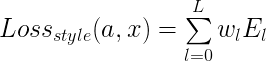
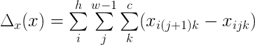
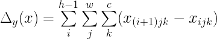
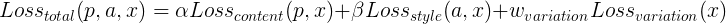

# Neural Style Transfer
Implementation of Neural Style Transfer from the paper [A Neural Algorithm of Artistic Style](https://arxiv.org/abs/1508.06576) (_Gatys et al._) in Tensorflow 2.0.

# Examples
These examples are generated using default [options](#options).

Images used can be found in the `data/demo` directory.

## Example 1
<p align='center'>
    
    
    
<p>

## Example 2
<p align='center'>
    
    
    
<p>

# Demo
A demo is available on [Google Colab](https://colab.research.google.com/github/kw01sg/neural-style-transfer/blob/master/google_colab_demo.ipynb) in the form of a Colab notebook.

Code for the Colab notebook can be found in `google-colab-demo.ipynb`, which also includes a link to the notebook itself.

__Make sure to install Tensorflow 2.0 by running__
```
!pip install tensorflow-gpu==2.0.0-beta1
```
__and that GPU is enabled for the notebook.__

# Usage
## Requirements
* `Pillow==6.0.0`
* `tensorflow-gpu==2.0.0-beta1`

Required packages can be installed by running `pip install` on `requirements.txt`
```
pip install -r requirements.txt
```

To use the CPU version, replace `tensorflow-gpu==2.0.0-beta1` with `tensorflow==2.0.0-beta1` in `requirements.txt`. However, running on CPU is __very slow and is generally advised against__.

## Running
```
python neural_transfer.py --content-path <path of content image> --style-path <path of style image>
```

### Options
* `-h`, `--help` : Display help message
* `-c`, `--content-path` : Path of content image. _Default_: `data/demo/chicago.jpg`
* `-s`, `--style-path` : Path of style image. _Default_: `data/demo/candy.jpg`
* `-sw`, `--content-weight` : Content weight. _Default_: `1e-3`
* `-cw`, `--style-weight` : Style weight. _Default_: `1.0`
* `-vw`, `--variation-weight` : Variation weight. _Default_: `2e3`
* `-slw`, `--style-layer-weights` : Weights for individual layers in style layers. Will be normalized before calculation of style loss. _Default_: `1 1 1 1 1`
* `-wn`, `--white-noise-input` : Flag to use white noise image as initial image. If false, content image will be used as initial image. _Default_: `False`
* `-lr`, `--learning-rate` : Learning rate for Adam optimizer. _Default_: `10.0`
* `-e`, `--epochs` : Number of epochs. _Default_: `10`
* `-steps`, `--steps` : Number of steps per epoch. _Default_: `100`
* `-o`, `--output-file` : File name for generated image file. Path can include extension, for example `example.png`. If no extension is given, default extension is `png`. If no file name is provided, generated image will be output as `result.png`. All output files are saved in `data/results` directory. _Default_: `result.png`

# Implementation Details
Convolutional Neural Networks (CNN) consist of multiple layers of computational units that process visual information hierarchically in a feed-forward manner. Each layer of units can be understood as a collection of image filters, and each filter extracts a certain feature from the input image. Thus, the output of a given layer consists of a feature map that offers a  differently filtered version of the input image.

By separating how content and style are represented in CNNs, images that simultaneously matches the content representation of the content image and the style representation of the respective style image can be generated. While the global arrangement of the original content image is preserved, the colours and local structures that compose the global scenery are provided by the style image. Effectively, this renders the content in the style of the style image.

## Implementation
A given input image _x_ is encoded in each layer of the CNN by the output of its filters. For a layer _l_ with _N<sub>l</sub>_ distinct filters, it has _N<sub>l</sub>_ feature maps each of size _M<sub>l</sub>_, where _M<sub>l</sub>_ is the height times the width of the feature map.

Thus, the responses in a layer _l_ can be stored in a matrix  where _F<sup>l</sup><sub>ij</sub>_ is the activation of the _i<sup>th</sup>_ filter at position _j_ in layer _l_.

### Content Representation
Content representation was matched on layer __'block4_conv2'__ of the VGG19 network.

Let _p_ and _x_ be the original image and the image that is generated, and _P<sup>l</sup>_ and _F<sup>l</sup>_ their respective feature representation in layer _l_.

Content loss can be defined as the squared-error loss between the two feature representations:

<br>
<div align='center'>
    
</div>
<br>

### Style Representation
Style representation was matched on layers __'block1_conv1'__, __'block2_conv1'__, __'block3_conv1'__, __'block4_conv1'__ and __'block5_conv1'__ of the VGG19 network.

Style representation is defined by computing the correlations between the different filter responses in each layer of the network. These feature correlations are given by the Gram matrix , where _G<sup>l</sup><sub>ij</sub>_ is the inner product between the vectorised feature map _i_ and _j_ in layer _l_:

<br>
<div align='center'>
    
</div>
<br>

Let _a_ and _x_ be the original image and the image that is generated, and _A<sup>l</sup>_ and _G<sup>l</sup>_ their respective style representations in layer l.

The contribution of that layer to the total style loss is then defined as the mean-squared distance between the entries of the two Gram matrices:

<br>
<div align='center'>
    
</div>
<br>

and the total loss is:

<br>
<div align='center'>
    
</div>
<br>

where _w<sub>l</sub>_ are weighting factors of the contribution of each layer to the total style loss.

Weighting factors _w<sub>l</sub>_ is by default 1 for all layers. These weights are later normalized before calculation of style loss.

### Total Variation Loss
Total variation loss has also been included as a component in the loss function. This was not covered in the paper by Gatys et al. but was inspired by Tensorflow's [implementation of neural style transfer](https://www.tensorflow.org/beta/tutorials/generative/style_transfer#total_variation_loss).

Generating images that matches the content and style representations produces a lot of high frequency artifacts in the generated image. These can be decreased using an explicit regularization term on the high frequency components of the image.

Let _x_ be the generated image and _h_, _w_ and _c_ be its height, width, and number of channels.

Then horizontal variation is defined as:

<br>
<div align='center'>
    
</div>
<br>

while vertical variation is defined as:

<br>
<div align='center'>
    
</div>
<br>

Total variation loss:

<br>
<div align='center'>
    
</div>
<br>

### Overall Loss
To generate images that mix the content of the content image with the style of the style image, the distance of a white noise image from the content representation of the content image and the style representation of the style image is minimized through gradient descent. Variation loss is also taken into consideration for a smoother generated image.

Let _p_ be the content image, _a_ be the style image and _x_ be the generated image. The loss function can be defined as

<br>
<p align='center''>
    
</p>
<br>

where α and β are the weighting factors for content and style reconstruction respectively.

The paper uses a α/β ratio of 1 x 10<sup>-3</sup> or 1 x 10<sup>-4</sup> for relative weightings of the content and style reconstruction loss. By default, a α/β ratio of 1 x 10<sup>-3</sup> is used, although both α and β are tunable options.
